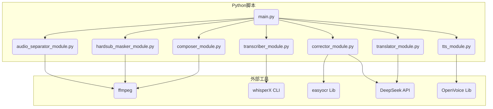
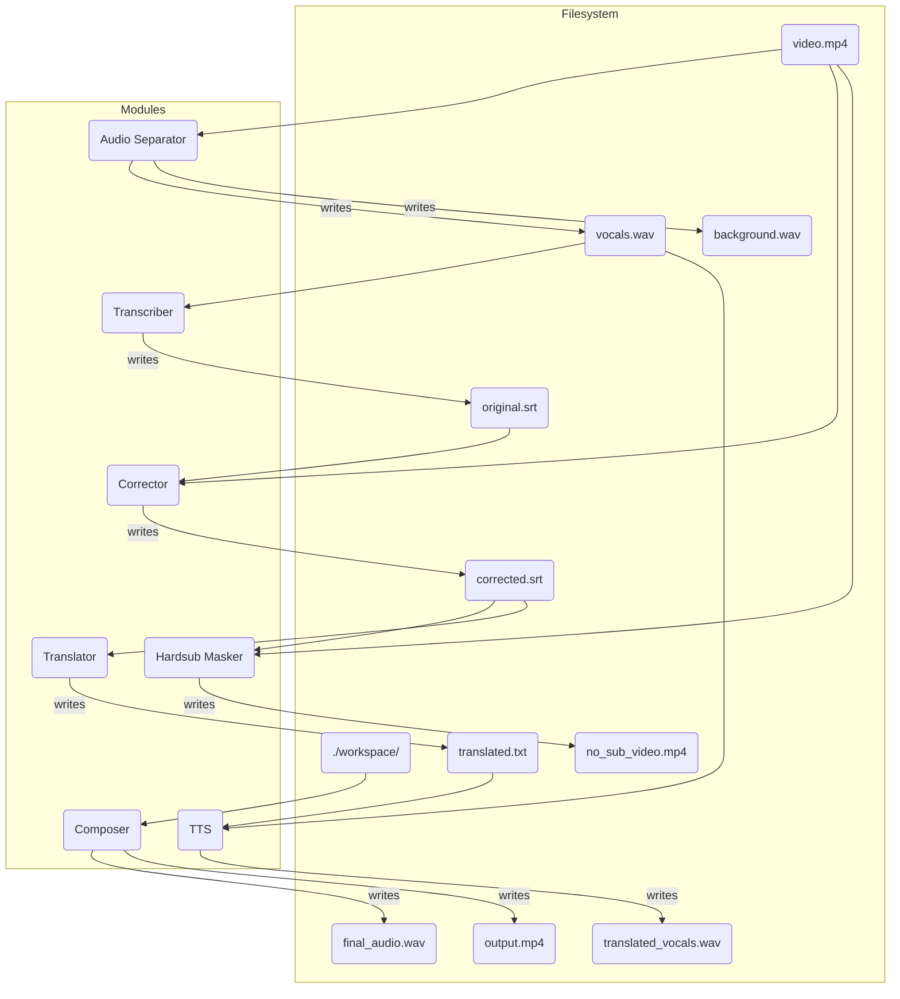

# 设计文档：自动化视频翻译 (AUTOMATED_VIDEO_TRANSLATION)

## 1. 总体架构

本系统是一个基于管道（Pipeline）模式的命令行工具。总控脚本 `main.py` 将依次调用各个独立的模块，每个模块负责一项核心任务，并将处理结果以文件形式传递给下一个模块。这种松耦合的设计便于独立开发、测试和替换任何一个环节。

### 1.1. 总体架构图 (Mermaid)

```mermaid
graph TD
    A[输入: video.mp4] --> B{1. 音频分离};
    B --> C[人声.wav];
    B --> D[背景声.wav];
    C --> E{2. 语音识别 (whisperX)};
    E --> F[原文.srt];
    F --> G{3. 字幕校对 (OCR+LLM)};
    A --> G;
    G --> H[校对后.srt];
    H --> I{4. 文本翻译 (DeepSeek)};
    I --> J[译文.txt];
    H --> K{5. 原字幕处理 (OpenCV)};
    A --> K;
    K --> L[无字幕视频或遮罩数据];
    C & H --> M{6. 语音克隆 (OpenVoice)};
    M --> N[英文对白.wav];
    D & J & L & N --> O{7. 最终合成 (ffmpeg)};
    O --> P[输出: translated_video.mp4];
```

### 1.2. 模块依赖关系图 (Mermaid)



## 2. 核心模块接口定义

为了管理流程中产生的中间文件，我们将创建一个以输入视频名命名的临时工作目录，如 `./workspace/my_video/`。

### 2.1. `audio_separator_module.py`
- **函数签名**: `separate_audio(video_path: str, workspace: str) -> (str, str)`
- **输出**: `(vocals_path, background_path)`

### 2.2. `transcriber_module.py`
- **函数签名**: `transcribe(vocals_path: str, workspace: str) -> (str, str)`
- **输出**: `(transcription_srt_path, diarization_info_path)`

### 2.3. `corrector_module.py` (新增)
- **函数签名**: `correct_subtitle(video_path: str, srt_path: str, workspace: str, config: dict) -> str`
- **输入**:
    - `video_path`: 原始视频文件路径 (用于OCR)。
    - `srt_path`: `whisperX` 生成的原始srt文件。
    - `workspace`: 临时工作目录。
    - `config`: 包含校对模式 (`ocr_only`, `llm_only`, `hybrid`) 和API Key的字典。
- **操作**: 根据配置的模式，执行相应的校对逻辑。
- **输出**: `corrected_srt_path`，指向 `workspace/corrected.srt`。

### 2.4. `hardsub_masker_module.py` (更新)
- **函数签名**: `mask_hardsubs(video_path: str, corrected_srt_path: str, workspace: str, strategy: str) -> str`
- **输入**:
    - `corrected_srt_path`: 校对后的srt文件，用于获取时间戳。
    - `strategy`: 遮罩策略 (`direct_overlay` 或 `clean_pass`)。
- **操作**: 
    - 根据`strategy`，或者生成一个完整的无字幕视频 (`clean_pass`)，或者仅在需要时处理帧并传递给合成器。
    - **优化**: 只处理 `corrected_srt_path` 中有字幕的时间区间的帧。
- **输出**: `processed_video_path` (如果使用`clean_pass`策略)。

### 2.5. `translator_module.py` (更新)
- **函数签名**: `translate(corrected_srt_path: str, workspace: str, api_key: str) -> str`
- **输入**: `corrected_srt_path` (使用校对后的srt)。
- **输出**: `translated_text_path`。

### 2.6. `tts_module.py` (更新)
- **函数签名**: `synthesize(vocals_path: str, translated_text_path: str, diarization_info_path: str, workspace: str) -> str`
- **输入**: `diarization_info_path` (从`transcriber`模块获取)。
- **输出**: `translated_vocals_path`。

### 2.7. `composer_module.py` (更新)
- **函数签名**: `compose_video(config: dict)`
- **输入**: 一个包含所有文件路径和策略配置的字典。
- **操作**: 
    - 根据`hardsub_mask_strategy`选择不同的`ffmpeg`命令。
    - **策略A (clean_pass)**: `ffmpeg -i no_sub.mp4 -i final_audio.wav -filter_complex "[0:v]subtitles=final.srt[v]" ...`
    - **策略B (direct_overlay)**: `ffmpeg -i video.mp4 -i final_audio.wav -vf "subtitles=final.srt, ..." ...` (此处的filter会更复杂，需要动态生成)。
- **输出**: 无。

## 3. 关键数据流图 (Mermaid)



## 4. 错误处理策略

- **日志记录**: 所有模块都使用 Python 的 `logging` 模块，将日志输出到控制台，并可配置写入到 `workspace/log.txt`。
- **异常捕获**: `main.py` 的主流程控制将包含 `try...except` 块，捕获每个模块执行期间的异常。
- **失败即停止**: 任何一个模块执行失败，整个流程将立即停止，并报告错误信息，保留临时文件以便调试。
- **依赖检查**: 在主流程开始时，检查 `ffmpeg` 是否在系统 `PATH` 中。
