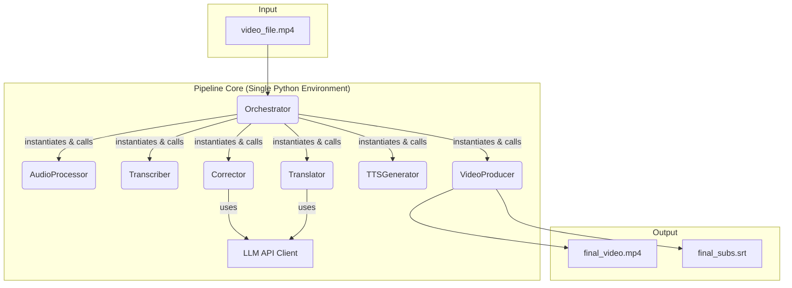

# 系统设计文档 (Design v5 - 实施同步版): AUTOMATED_VIDEO_TRANSLATION

**版本说明: v5版本根据最终代码实现进行了重写，准确反映了项目的当前架构。**

## 1. 总体架构图

系统采用基于**直接类调用**的紧耦合流水线架构。中心“编排器” (Orchestrator) 负责在**单一Python环境**中实例化并执行各个模块，模块间通过内存对象和文件系统进行数据交换。

## 2. 模块化设计与执行方式

- **`orchestrator.py`**: 流程编排器。核心职责为：直接导入并实例化每个模块的Python类（如`Transcriber`, `TTSGenerator`），调用其`run`方法，管理和传递参数，并监控执行结果。整个流程运行在**同一个Python进程**中。
- **模块类**: 每个模块（如`transcriber/`）的核心逻辑被封装在一个Python类中（如`Transcriber`类）。虽然部分模块保留了`run.py`用于独立测试，但主流程不通过CLI调用它们。
- **依赖管理**: 所有模块的依赖项（如`whisperX`, `OpenVoice`等）都安装在**同一个Python环境**中。这简化了部署，但也要求所有依赖项彼此兼容。
- **密钥管理**: 所有需要API密钥的模块（如`Translator`）将直接从**环境变量**中读取密钥，而不是从配置文件或代码中读取。
- **`config.py`**: 负责加载和管理项目**非敏感**配置。将提供一个`config.yaml.template`模板文件，其中会注明需要用户设置哪些环境变量。

## 3. 核心接口定义 (Module Interfaces)

`Orchestrator`通过直接调用模块类的方法来驱动流水线。以下是关键的内部接口（简化表示）：

- **Audio Processor**
  `AudioProcessor().run(video_path: str) -> (vocals_path: str, background_path: str)`
- **Transcriber**
  `Transcriber().run(audio_path: str, lang: str) -> List[Segment]`
- **Corrector**
  `Corrector().run(segments: List[Segment]) -> List[Segment]`
- **Translator**
  `Translator().run(segments: List[Segment], target_lang: str) -> List[Segment]`
- **TTS Generator**
  `TTSGenerator().run(segments: List[Segment], ref_audio: str, target_lang: str) -> dubbed_vocals_path: str`
- **Video Producer**
  `VideoProducer().run(original_video: str, dubbed_audio: str, bg_audio: str, segments: List[Segment]) -> (output_video: str, output_srt: str)`

## 4. 关键设计策略

### 4.1. 核心原则: “孤岛”策略
- **决策**: 我们**不采用**说话人识别技术。每个语音片段被视为独立的“孤岛”。
- **理由**: 此举可**100%避免**“声画错位”（即A说话，B发声）这一最严重的逻辑错误。我们接受“局部音色可能因参考音质量不佳而略有瑕疵”的风险，以此换取“角色身份绝对正确”的健壮性。

### 4.2. 核心策略: VAD混合时长校准
- **目标**: 在保证声音自然度的前提下，使翻译后音轨的时长与原视频口型时间轴精确对齐。
- **工作流程**:
    1.  **LLM智能译写**: 在翻译文本时（T3），向LLM提供原始时长作为上下文，引导其生成长度适中的译文。
    2.  **自然语速生成**: TTS模块（T4）首先以最自然的语速生成音频，不进行任何强制变速。
    3.  **VAD静音规整**:
        - 使用VAD（Voice Activity Detection）技术分析生成好的音频，识别出其中的“说话”部分和“静音”部分。
        - **如果“说话”部分总时长小于等于目标时长**：则通过压缩/扩展“静音”部分，将音频总长精确调整到目标时长。此过程不改变任何说话声音的语速，效果最自然。
        - **如果“说话”部分总时长已超过目标时长**：则启用备用方案。
    4.  **备用方案: 强制语速调整**:
        - 在上述VAD方案无法解决的极端情况下，TTS模块将对**这一个**音频片段重新进行一次生成，但这次会强制设定其输出时长，通过微调语速来确保对齐。

### 4.3. 依赖管理
- **问题**: `whisperX`和`OpenVoice`等重量级深度学习库存在潜在的依赖冲突。
- **解决方案**: 项目采用**单一环境**策略。所有依赖项被安装在同一个Python（Conda或Venv）环境中。这要求在`requirements.txt`或环境创建命令中仔细管理包版本，以确保所有库都能共存。虽然牺牲了环境隔离的灵活性，但大大简化了项目的执行和部署流程。

## 5. 错误处理与密钥管理

- **异常捕获**: `Orchestrator`将使用`try...except`块来捕获每个模块执行期间的Python异常。
- **日志记录**: 使用Python的`logging`模块记录详细的执行信息、警告和错误，便于追踪问题。
- **健壮性**: `finally`块和临时文件清理策略保持不变。
- **密钥管理**: **所有API密钥（如`DEEPSEEK_TOKEN`, `HUGGING_FACE_TOKEN`）严禁硬编码。** 程序将从**环境变量**中读取这些密钥。项目将提供文档说明需要设置哪些变量。