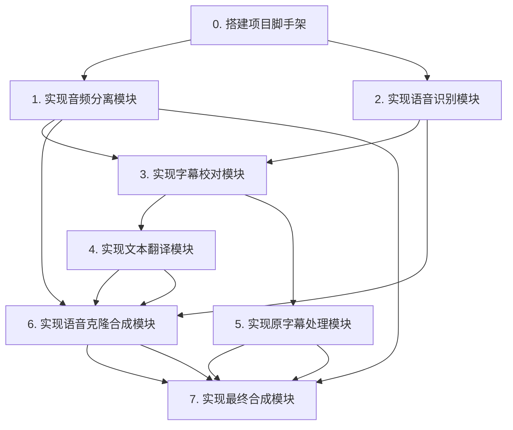

# 任务分解文档：自动化视频翻译 (AUTOMATED_VIDEO_TRANSLATION)

## 1. 任务依赖图 (Mermaid)

## 2. 原子任务列表

### **任务 0: 项目脚手架**
- **描述**: 创建项目的主目录结构，包括 `main.py` 入口文件，`modules` 目录用于存放各个功能模块，`workspace` 目录用于存放临时文件，以及 `configs` 目录用于存放配置文件。
- **输入**: 无。
- **输出**: 项目目录结构。
- **依赖**: 无。

### **任务 1: 音频分离模块 (`audio_separator_module.py`)**
- **描述**: 实现 `separate_audio` 函数。该函数调用 `ffmpeg` 提取音频，然后使用 `audio_separator` 库将其分离为人生和背景声。
- **输入**: 视频文件路径，工作目录路径。
- **输出**: 人声音频路径 (`vocals.wav`)，背景声音频路径 (`background.wav`)。
- **依赖**: 任务 0。

### **任务 2: 语音识别模块 (`transcriber_module.py`)**
- **描述**: 实现 `transcribe` 函数。该函数在指定的conda环境下，通过子进程调用 `whisperX` 命令行工具，生成带时间戳和说话人信息的SRT文件。
- **输入**: 人声音频路径，工作目录路径。
- **输出**: 原始SRT文件路径 (`original.srt`)，说话人信息文件路径。
- **依赖**: 任务 0。

### **任务 3: 字幕校对模块 (`corrector_module.py`)**
- **描述**: 实现 `correct_subtitle` 函数。这是个核心模块，需要实现三种可配置的校对模式（OCR, LLM, Hybrid）。
- **输入**: 原始视频路径，原始SRT文件路径，工作目录，配置文件（含模式、API Key）。
- **输出**: 校对后的SRT文件路径 (`corrected.srt`)。
- **依赖**: 任务 1, 任务 2。

### **任务 4: 文本翻译模块 (`translator_module.py`)**
- **描述**: 实现 `translate` 函数。该函数读取校对后的SRT文件，调用大模型API进行翻译。
- **输入**: 校对后的SRT文件路径，工作目录，API Key。
- **输出**: 翻译后的文本文件路径 (`translated.txt`)。
- **依赖**: 任务 3。

### **任务 5: 原字幕处理模块 (`hardsub_masker_module.py`)**
- **描述**: 实现 `mask_hardsubs` 函数。根据校对后的SRT时间戳，使用OpenCV对原视频进行处理。支持“净版”和“遮罩”两种策略。
- **输入**: 原始视频路径，校对后的SRT文件路径，工作目录，处理策略配置。
- **输出**: 处理后的视频路径（仅“净版”策略）或遮罩数据。
- **依赖**: 任务 3。

### **任务 6: 语音克隆合成模块 (`tts_module.py`)**
- **描述**: 实现 `synthesize` 函数。根据说话人信息从原始人声中提取参考音频，调用 `OpenVoice` 将翻译好的文本合成为语音。
- **输入**: 原始人声音频路径，翻译后的文本路径，说话人信息路径，工作目录。
- **输出**: 翻译后的完整人声音轨路径 (`translated_vocals.wav`)。
- **依赖**: 任务 1, 任务 2, 任务 4。

### **任务 7: 最终合成模块 (`composer_module.py`)**
- **描述**: 实现 `compose_video` 函数。这是一个复杂的 `ffmpeg` 调用封装，根据不同的输入（是否是“净版”视频）和策略，将所有部分（视频流、新音轨、新字幕）合成为最终的视频文件。
- **输入**: 包含所有需要的媒体文件路径和配置的字典。
- **输出**: 最终的视频文件 (`output.mp4`)。
- **依赖**: 任务 1, 任务 5, 任务 6。
