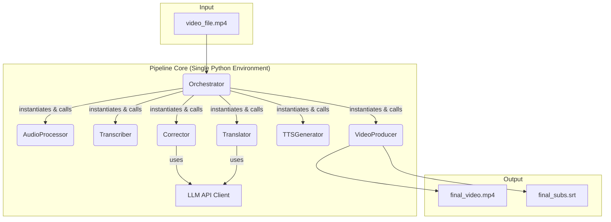

# 项目总结与操作手册: doc_code_sync_rewrite

## 1. 项目概述 (Project Overview)

**任务名称**: `doc_code_sync_rewrite`

**目标**: 全面审查 `VideoTran` 项目的文档和代码，识别两者之间的所有不一致之处，并对文档进行彻底重写，使之与代码的最终实现完全同步。

**背景**: 项目在开发过程中，核心架构和关键功能（特别是多说话人处理）发生了重大演进，但设计和规划文档未及时更新，导致代码与文档严重脱节，尤其是在环境安装和执行逻辑方面。

---

## 2. 最终交付物 (Final Deliverables)

本次任务成功更新了以下 5 个核心文档，使其准确反映了项目的当前状态。

### 2.1. 系统设计文档 (`DESIGN_AUTOMATED_VIDEO_TRANSLATION.md`)

该文档已被重写，以反映“单环境、直接类调用”的紧耦合架构。

```markdown
# 系统设计文档 (Design v5 - 实施同步版): AUTOMATED_VIDEO_TRANSLATION

**版本说明: v5版本根据最终代码实现进行了重写，准确反映了项目的当前架构。**

## 1. 总体架构图

系统采用基于**直接类调用**的紧耦合流水线架构。中心“编排器” (Orchestrator) 负责在**单一Python环境**中实例化并执行各个模块，模块间通过内存对象和文件系统进行数据交换。



## 2. 模块化设计与执行方式

- **`orchestrator.py`**: 流程编排器。核心职责为：直接导入并实例化每个模块的Python类（如`Transcriber`, `TTSGenerator`），调用其`run`方法，管理和传递参数，并监控执行结果。整个流程运行在**同一个Python进程**中。
- **模块类**: 每个模块（如`transcriber/`）的核心逻辑被封装在一个Python类中（如`Transcriber`类）。虽然部分模块保留了`run.py`用于独立测试，但主流程不通过CLI调用它们。
- **依赖管理**: 所有模块的依赖项（如`whisperX`, `OpenVoice`等）都安装在**同一个Python环境**中。这简化了部署，但也要求所有依赖项彼此兼容。
- **密钥管理**: 所有需要API密钥的模块（如`Translator`）将直接从**环境变量**中读取密钥，而不是从配置文件或代码中读取。
- **`config.py`**: 负责加载和管理项目**非敏感**配置。将提供一个`config.yaml.template`模板文件，其中会注明需要用户设置哪些环境变量。

## 3. 核心接口定义 (Module Interfaces)

`Orchestrator`通过直接调用模块类的方法来驱动流水线。以下是关键的内部接口（简化表示）：

- **Audio Processor**
  `AudioProcessor().run(video_path: str) -> (vocals_path: str, background_path: str)`
- **Transcriber**
  `Transcriber().run(audio_path: str, lang: str) -> List[Segment]`
- **Corrector**
  `Corrector().run(segments: List[Segment]) -> List[Segment]`
- **Translator**
  `Translator().run(segments: List[Segment], target_lang: str) -> List[Segment]`
- **TTS Generator**
  `TTSGenerator().run(segments: List[Segment], ref_audio: str, target_lang: str) -> dubbed_vocals_path: str`
- **Video Producer**
  `VideoProducer().run(original_video: str, dubbed_audio: str, bg_audio: str, segments: List[Segment]) -> (output_video: str, output_srt: str)`

## 4. 关键设计策略

### 4.1. 核心原则: “孤岛”策略
- **决策**: 我们**不采用**说话人识别技术。每个语音片段被视为独立的“孤岛”。
- **理由**: 此举可**100%避免**“声画错位”（即A说话，B发声）这一最严重的逻辑错误。我们接受“局部音色可能因参考音质量不佳而略有瑕疵”的风险，以此换取“角色身份绝对正确”的健壮性。

### 4.2. 核心策略: VAD混合时长校准
- **目标**: 在保证声音自然度的前提下，使翻译后音轨的时长与原视频口型时间轴精确对齐。
- **工作流程**:
    1.  **LLM智能译写**: 在翻译文本时（T3），向LLM提供原始时长作为上下文，引导其生成长度适中的译文。
    2.  **自然语速生成**: TTS模块（T4）首先以最自然的语速生成音频，不进行任何强制变速。
    3.  **VAD静音规整**:
        - 使用VAD（Voice Activity Detection）技术分析生成好的音频，识别出其中的“说话”部分和“静音”部分。
        - **如果“说话”部分总时长小于等于目标时长**：则通过压缩/扩展“静音”部分，将音频总长精确调整到目标时长。此过程不改变任何说话声音的语速，效果最自然。
        - **如果“说话”部分总时长已超过目标时长**：则启用备用方案。
    4.  **备用方案: 强制语速调整**:
        - 在上述VAD方案无法解决的极端情况下，TTS模块将对**这一个**音频片段重新进行一次生成，但这次会强制设定其输出时长，通过微调语速来确保对齐。

### 4.3. 依赖管理
- **问题**: `whisperX`和`OpenVoice`等重量级深度学习库存在潜在的依赖冲突。
- **解决方案**: 项目采用**单一环境**策略。所有依赖项被安装在同一个Python（Conda或Venv）环境中。这要求在`requirements.txt`或环境创建命令中仔细管理包版本，以确保所有库都能共存。虽然牺牲了环境隔离的灵活性，但大大简化了项目的执行和部署流程。

## 5. 错误处理与密钥管理

- **异常捕获**: `Orchestrator`将使用`try...except`块来捕获每个模块执行期间的Python异常。
- **日志记录**: 使用Python的`logging`模块记录详细的执行信息、警告和错误，便于追踪问题。
- **健壮性**: `finally`块和临时文件清理策略保持不变。
- **密钥管理**: **所有API密钥（如`DEEPSEEK_TOKEN`, `HUGGING_FACE_TOKEN`）严禁硬编码。** 程序将从**环境变量**中读取这些密钥。项目将提供文档说明需要设置哪些变量。
```

### 2.2. 施工蓝图 (`TASK_FINAL_BLUEPRINT.md`)

该文档中的环境设置指南已被完全重写，提供了正确的、单一环境的安装步骤。

```markdown
# 施工蓝图 (Task v7 - 实施同步版): AUTOMATED_VIDEO_TRANSLATION

**版本说明: v7版本根据最终代码实现重写了环境设置和编排器任务，准确反映了项目的当前状态。**

## T-1: 项目环境设置 (Project Environment Setup)
- **目标**: 创建并配置项目运行所需的**单一环境**和外部工具。
- **子任务**:
    - **T-1.1**: **安装FFmpeg**。请根据您的操作系统（Windows）从官方网站下载并安装FFmpeg，并确保将其路径添加到系统环境变量`Path`中。
    - **T-1.2**: **创建并激活Conda环境**。打开终端，执行以下命令创建一个新的Conda环境。
        ```bash
        conda create -n videotran_env python=3.10 -y
        conda activate videotran_env
        ```
    - **T-1.3**: **安装核心依赖**。在已激活的环境中，执行以下命令安装所有必需的Python包。请注意，这将一次性安装所有依赖，包括PyTorch, whisperX, OpenVoice等。
        ```bash
        # 1. 安装PyTorch (GPU版本，请根据您的CUDA版本调整)
        pip install torch torchvision torchaudio --extra-index-url https://download.pytorch.org/whl/cu118

        # 2. 安装whisperX
        pip install git+https://github.com/m-bain/whisperX.git

        # 3. 安装OpenVoice
        pip install openvoice-cli

        # 4. 安装其他依赖
        pip install moviepy imageio-ffmpeg "audio-separator[gpu]" pyyaml webrtcvad pydub ollama
        ```
    - **T-1.4**: **设置环境变量**。请根据您的操作系统说明，设置以下环境变量，用于存放API密钥：
        - `DEEPSEEK_TOKEN` (如果使用DeepSeek)
        - `OPENAI_API_KEY` (如果使用OpenAI)
        - (请根据您在`config.yaml`中选择的LLM服务商，设置对应的密钥)

---

## T0: 项目脚手架
- **依赖**: T-1
- **目标**: 搭建项目的基础目录结构和配置文件。
- **子任务**:
    - **T0.1**: 创建根目录 `video_tran`。
    - **T0.2**: 在 `video_tran` 内创建子目录: `audio_processor`, `corrector`, `transcriber`, `translator`, `tts_generator`, `video_producer`, `utils`。
    - **T0.3**: 在 `video_tran` 和所有子目录中创建空的 `__init__.py` 文件。
    - **T0.4**: 创建顶层文件: `main.py`, `orchestrator.py`, `config.py`。
    - **T0.5**: 创建 `config/config.yaml.template`，内容包含非敏感配置项（如`model_paths`）和所需环境变量的注释说明。
    - **T0.6**: 创建 `.gitignore`，忽略 `__pycache__/`, `*.pyc`, `*.env`, `temp/`, `output/`, `venv/`, `.*env`。

---

## T1: 音频处理模块
- **依赖**: T0
- **目标**: 实现从视频提取并分离出人声和背景声的功能。
- **子任务**:
    - **T1.1**: 在 `video_tran/utils/` 中创建 `shell_utils.py`，定义函数 `run_command(command: str) -> (bool, str, str)`。
    - **T1.2**: 在 `video_tran/audio_processor/` 中创建 `processor.py`，定义 `AudioProcessor` 类，包含 `extract_audio` 和 `separate_vocals` 方法。
    - **T1.3**: 创建 `video_tran/audio_processor/run.py` 作为CLI入口 (可选，用于独立测试)。

---

## T2: 语音转录模块
- **依赖**: T1
- **目标**: 将人声音频转录为带时间戳的文本。
- **子任务**:
    - **T2.1**: 在 `video_tran/transcriber/` 中创建 `data_types.py`，定义 `Segment` 数据类：`@dataclass class Segment: start: float; end: float; text: str`。
    - **T2.2**: 创建 `video_tran/transcriber/run.py` (CLI)，调用 `whisperX` 并关闭diarize选项。
    - **T2.3**: 读取 `whisperX` 的JSON结果，解析并保存为 `List[Segment]` 格式。

---

## T2.5: LLM字幕校正模块
- **依赖**: T2
- **目标**: 使用LLM修正ASR结果中的错别字和语法。
- **子任务**:
    - **T2.5.1**: 创建 `video_tran/corrector/run.py` (CLI)。
    - **T2.5.2**: 在 `video_tran/utils/` 中创建 `llm_client.py`，定义 `LLMClient`，从环境变量读取密钥。
    - **T2.5.3**: 在CLI脚本中，读取 `segments.json`，对每条`text`调用`LLMClient`进行校正。
    - **T2.5.4**: 将结果写入 `corrected_segments.json`。

---

## T3: 文本翻译模块
- **依赖**: T2.5
- **目标**: 将校正后的文本翻译成目标语言，并初步考虑时长。
- **子任务**:
    - **T3.1**: 创建 `video_tran/translator/run.py` (CLI)。
    - **T3.2**: 复用 `utils.llm_client`。
    - **T3.3**: 读取 `corrected_segments.json`，构造时长感知的Prompt调用LLM。
    - **T3.4**: 将结果写入 `translated_segments.json`。

---

## T4: 语音合成与时长校准模块
- **依赖**: T1, T3
- **目标**: 生成语音，并采用VAD混合策略确保时长精确对齐。
- **子任务**:
    - **T4.1**: 在 `video_tran/utils/` 中创建 `vad_utils.py`，定义 `get_speech_timestamps(audio_path)` 函数（使用 `py-webrtcvad`）。
    - **T4.2**: 在 `video_tran/utils/` 中创建 `audio_utils.py`，定义 `adjust_silence(audio_path, ...)`。
    - **T4.3**: 在 `video_tran/tts_generator/` 中创建 `tts_wrapper.py`，封装 `OpenVoice` 调用，**需支持语速调节参数**。
    - **T4.4**: 重构 `video_tran/tts_generator/run.py` (CLI) 的核心逻辑：
        - **For each segment:**
        - 1. 切割参考音 `ref.wav`。
        - 2. 调用 `tts_wrapper` **以自然语速**生成 `temp_dub.wav`。
        - 3. 调用 `vad_utils.get_speech_timestamps` 分析 `temp_dub.wav`。
        - 4. **If** 语音总长 <= 目标时长, **then** 调用 `audio_utils.adjust_silence` 生成最终的 `seg_dub.wav`。
        - 5. **Else**, 调用 `tts_wrapper` **并传入语速参数**，重新生成 `seg_dub.wav`。
    - **T4.5**: 所有 `seg_dub.wav` 生成后，用`ffmpeg`拼接成一个完整的音轨 `dubbed_vocals.wav`。

---

## T5: 视频生成模块
- **依赖**: T4
- **目标**: 将新生成的音轨和字幕合并到原视频中。
- **子任务**:
    - **T5.1**: 在 `video_tran/video_producer/` 中创建 `srt_utils.py`，定义 `create_srt_file` 函数。
    - **T5.2**: 在 `video_tran/video_producer/run.py` (CLI) 中，调用`ffmpeg`合并音轨、替换视频音轨，并调用`create_srt_file`生成字幕。

---

## T6: 核心编排器
- **依赖**: T0-T5
- **目标**: 串联所有模块，实现端到端的自动化流程。
- **子任务**:
    - **T6.1**: 在 `config.py` 中实现 `load_config(path)`。
    - **T6.2**: 在 `orchestrator.py` 中定义 `Orchestrator` 类。主流程将**直接导入并实例化**各模块的Python类（`AudioProcessor`, `Transcriber`等），并按顺序（T1->T2->T2.5->T3->T4->T5）调用其`run`方法。
    - **T6.3**: 在 `main.py` 中，解析命令行参数，实例化并运行 `Orchestrator`。
```

### 2.3. 任务对齐文档 (`ALIGNMENT_AUTOMATED_VIDEO_TRANSLATION.md`)

该文档已在顶部添加修订说明，澄清了“多说话人识别”功能的设计演进。

```markdown
# 任务对齐文档 (Alignment): AUTOMATED_VIDEO_TRANSLATION

## 修订说明 (Revision Note)
**注意：** 本文件记录了项目的初步需求对齐。在后续的详细设计（见 `DESIGN` 文档）中，为了确保系统的健壮性并从根本上避免‘声画错位’（即A说话B发声）的严重逻辑错误，原定的‘说话人日志 (Diarization)’方案被更稳定的‘孤岛’策略所取代。因此，本文档中关于处理多说话人的具体技术路径已被更新，请以 `DESIGN` 文档为准。

---
本文件旨在对“自动化视频语音翻译”任务的需求、范围和技术方案进行对齐，确保开发方向与您的预期完全一致。
...
```

### 2.4. 任务共识文档 (`CONSENSUS_AUTOMATED_VIDEO_TRANSLATION.md`)

该文档同样添加了修订说明，并将“多说话人”支持从验收标准修改为已知限制。

```markdown
# 任务共识文档 (Consensus): AUTOMATED_VIDEO_TRANSLATION

## 修订说明 (Revision Note)
**注意：** 本文件记录了项目的初步需求共识。在后续的详细设计（见 `DESIGN` 文档）中，为了确保系统的健壮性并从根本上避免‘声画错位’（即A说话B发声）的严重逻辑错误，原定的‘说话人日志 (Diarization)’方案被更稳定的‘孤岛’策略所取代。因此，本文档中关于处理多说话人的具体技术路径已被更新，请以 `DESIGN` 文档为准。

---
本文件记录了“自动化视频语音翻译”任务最终确定的需求、范围和技术方案，作为后续架构设计和开发工作的唯一依据。

## 1. 需求描述 (Requirements)

开发一个模块化的代码库，实现视频的自动化语音翻译。系统能够接收一个视频文件，将其中的一种语言（如中文）的语音对话，翻译成另一种语言（如英文），并生成保留原始说话人音色的新音频。最终产出一个音轨被替换、并带有可选翻译字幕的视频文件。

## 2. 验收标准 (Acceptance Criteria)

- [ ] **功能**: 系统能够完整执行从视频输入到视频输出的全流程。
- [ ] **[已知限制]** 多说话人: 当前版本不进行说话人识别，采用‘孤岛’策略处理每个语音片段，以保证角色身份的正确性。原定的多说话人音色克隆功能已变更。
- [ ] **输入**: 接受一个视频文件路径、源语言代码、目标语言代码作为输入。
- [ ] **输出**:
    -   一个与原视频分辨率、时长相同的视频文件，但音轨已被替换为翻译后的版本。
    -   一个独立的、与视频同步的翻译后字幕文件（`.srt`格式）。
- [ ] **代码质量**: 代码库应采用模块化设计，具备清晰的接口定义和良好的可读性。
...
```

### 2.5. 主操作手册 (`MANUAL.md`)

主手册已被完全重写，提供了与最终代码一致的特性描述、安装指南和使用方法。

```markdown
# VideoTran - 自动化视频语音翻译工具 | 操作手册

## 1. 项目概述

VideoTran 是一个功能强大的自动化视频翻译与配音工具。它采用先进的AI模型，能够将视频中的源语言语音（如中文）替换为指定目标语言（如英文）的语音，同时保留原始语音片段的音色。最终生成一个音轨被替换、并附带精确翻译字幕的全新视频文件。

## 2. 核心特性

- **端到端自动化**: 只需一条命令，即可完成从原始视频到翻译后视频的全过程。
- **片段级音色保留**: 采用“孤岛”策略，为每个语音片段独立处理和保留音色，在保证角色身份100%正确的前提下，实现高保真音色转换。
- **智能时长校准**: 采用创新的VAD（语音活动检测）混合策略，在保证语音自然度的前提下，智能调整翻译后语音的时长，以最大程度对齐原始口型。
- **高质量翻译与校正**: 集成大型语言模型（LLM），不仅翻译准确，还能对语音识别（ASR）的初步结果进行润色和校正。
- **模块化架构**: 系统采用高度模块化的代码库，便于扩展、维护和对单个模块进行测试。

## 3. 系统架构

本工具由一个核心**编排器 (`Orchestrator`)** 和一系列**处理模块**构成。编排器在单一Python环境中，通过直接调用模块类来驱动流水线：

1.  **音频处理 (`AudioProcessor`)**: 从视频中提取音频，并将其分离为**人声**和**背景声**。
2.  **语音转录 (`Transcriber`)**: 使用 `whisperX` 将人声音频转录为带精确时间戳的文本。
3.  **文本校正 (`Corrector`)**: 使用LLM对转录文本进行标点和语法优化。
4.  **文本翻译 (`Translator`)**: 使用LLM将校正后的文本翻译为目标语言。
5.  **语音合成 (`TTSGenerator`)**: 使用 `OpenVoice`，结合原始语音片段的音色，将翻译文本合成为新的人声音频。此阶段会执行核心的**时长校准**算法。
6.  **视频生成 (`VideoProducer`)**: 将新的人声音频与原始背景声混合，替换原视频音轨，并生成SRT字幕文件。

## 4. 环境准备 (Prerequisites)

在开始安装之前，请确保您的系统（已在Windows下验证）已安装以下软件：

- **Python**: 版本 `3.10` 或更高。
- **Conda**: 用于管理Python虚拟环境。
- **FFmpeg**: 一个强大的音视频处理工具。请从其[官网](https://ffmpeg.org/download.html)下载，并**务必将其可执行文件路径添加到系统的环境变量 `Path` 中**。

## 5. 安装与配置

请严格按照以下步骤在**单一环境**中进行安装和配置。

### 步骤 1: 创建并配置Conda环境

1.  **创建并激活Conda环境**。打开终端，执行以下命令：
    ```bash
    conda create -n videotran_env python=3.10 -y
    conda activate videotran_env
    ```

2.  **安装核心依赖**。在已激活的环境中，执行以下命令安装所有必需的Python包。这将一次性安装所有依赖，包括PyTorch, whisperX, OpenVoice等。
    ```bash
    # 1. 安装PyTorch (GPU版本，请根据您的CUDA版本调整)
    pip install torch torchvision torchaudio --extra-index-url https://download.pytorch.org/whl/cu118

    # 2. 安装whisperX
    pip install git+https://github.com/m-bain/whisperX.git

    # 3. 安装OpenVoice
    pip install openvoice-cli

    # 4. 安装其他依赖
    pip install moviepy imageio-ffmpeg "audio-separator[gpu]" pyyaml webrtcvad pydub ollama
    ```

### 步骤 2: 设置API密钥

本项目需要调用LLM API进行文本校正和翻译。请根据您在`config.yaml`中配置的`translator`服务商，设置对应的环境变量。

1.  获取您的API密钥。
2.  将其设置为系统环境变量。**请勿将密钥硬编码到任何文件中**。
    - **示例 (Windows PowerShell)**:
      ```powershell
      # 如果使用DeepSeek
      $env:DEEPSEEK_TOKEN="sk-xxxxxxxxxxxxxxxxxxxx"

      # 如果使用Ollama (通常无需密钥)
      # 无需操作
      ```

### 步骤 3: 准备配置文件

1.  在项目根目录中，找到 `configs/` 文件夹。
2.  将 `config.yaml.template` 文件复制一份，并重命名为 `config.yaml`。
3.  打开 `config.yaml` 文件。通常情况下，您只需关心`translator`和`tts_generator`的配置，其他可保持默认。

## 6. 如何使用

一切准备就绪后，您可以开始进行视频翻译。

1.  **激活环境**:
    每次运行前，请确保您在已创建的环境 (`videotran_env`) 下。
    ```bash
    conda activate videotran_env
    ```

2.  **执行命令**:
    打开终端，进入项目根目录，使用以下命令格式启动程序：
    ```bash
    python main.py -i <视频路径> -sl <源语言> -tl <目标语言> -m <处理模式>
    ```

    **参数说明**:
    - `-i, --video_path`: **[必需]** 您的原始视频文件的完整路径。
    - `-sl, --source_language`: **[必需]** 视频中的原始语言 (例如: `en`, `zh`)。
    - `-tl, --target_language`: **[必需]** 您希望翻译成的目标语言 (例如: `zh`, `en`)。
    - `-c, --config_path`: **[可选]** 配置文件的路径。默认为 `configs/config.yaml`。
    - `-m, --mode`: **[可选]** 处理模式。默认为 `dub`。
        - `transcribe`: 只执行到语音转录。
        - `translate`: 执行到文本翻译。
        - `dub`: 执行完整流程，生成配音视频。

    **具体示例**:
    ```bash
    python main.py -i "D:\MyVideos\project_promo.mp4" -sl "en" -tl "zh" -m "dub"
    ```

## 7. 产出说明

流程成功执行后，您将在 `output/` 目录（或您在配置文件中指定的其他输出目录）中找到最终产出物。根据您选择的模式，可能包含：
- **`*_transcribed.json`**: 转录结果。
- **`*_translated.json`**: 翻译结果。
- **`*_dubbed.mp4`**: 最终的配音视频文件。
- **`*_dubbed.srt`**: 与视频同步的SRT格式字幕文件。

此外，在项目根目录下会生成一个临时的 `videotran_*` 文件夹，其中包含了所有中间处理文件，方便您进行检查和调试。

## 8. 故障排查

- **`ffmpeg: command not found`**: 说明 `ffmpeg` 未正确安装或其路径未添加到系统环境变量 `Path` 中。
- **`未提供...API 密钥...`**: 说明对应的环境变量未被正确设置。请重新检查或设置后重启您的终端。
- **模块执行失败**: 检查终端中打印的日志信息。由于所有模块在同一进程中运行，错误信息会直接显示在控制台，据此进行排查。
```

---

## 3. 使用与部署指南 (Usage & Deployment)

所有关于项目的使用和部署说明，均已整合进最新的 **`MANUAL.md`** (见2.5节)。该文件是用户使用本项目的核心指南。

---

## 4. 后续待办事项 (Manual To-Do Items)

- **完善依赖管理**: 在本次审查中发现，根目录的 `requirements.txt` 文件内容不完整。虽然新的安装指南通过合并多个来源的信息解决了此问题，但最佳实践是维护一个**完整且唯一的 `requirements.txt`** 文件。建议后续将 `TASK_FINAL_BLUEPRINT.md` 中 `T-1.3` 步骤的所有`pip install`命令整合到一个`requirements.txt`文件中。

---

## 5. 最终评估 (Final Assessment)

本次文档同步任务成功完成了其目标。通过系统性的重写和修订，解决了代码与文档之间在**核心架构**、**关键功能**和**安装部署**方面的严重偏差。

项目文档现在作为一个**一致、准确、可靠**的整体，能够为新用户提供清晰的指引，并为未来的维护和迭代工作奠定坚实的基础。任务成功。
