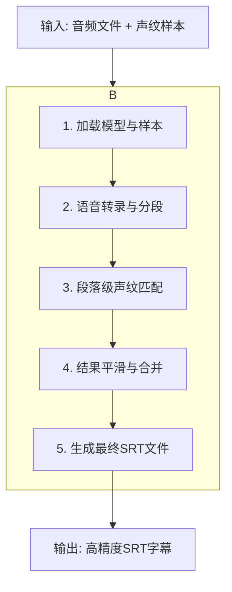
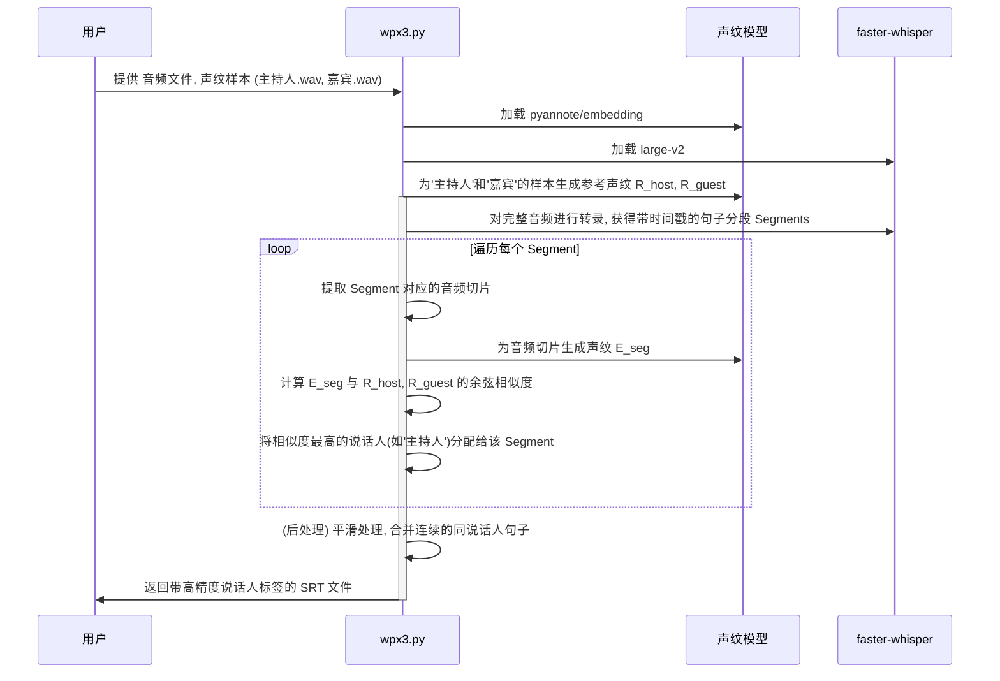

# 架构设计文档：高精度说话人识别流程 (wpx3)

## 1. 概述

本文档旨在为 `VideoTran` 项目设计一个全新的、高精度的说话人识别与字幕生成流程，代号 `wpx3`。该设计旨在取代现有 `wpx.py` 和 `wpx2.py` 的方案，从根本上解决无监督分离算法在特定音频上准确率不足的问题。

核心设计思想是 **“强监督、段落级声纹匹配”**。我们不再对整个音频进行一次性的“盲分”，而是利用 `whisper` 的高精度断句结果，对每一个语音段落进行独立的声纹识别，并将其与已知的说话人声纹进行比对，从而为每一句话找到最匹配的归属。

## 2. 整体架构图



## 3. 关键设计与数据流

### 3.1. 模块依赖图

```mermaid
graph TD
    subgraph 外部依赖
        D1[pyannote/embedding];
        D2[faster-whisper];
        D3[srt];
        D4[torchaudio];
    end

    subgraph 核心逻辑 (wpx3.py)
        L1[加载模块: load_models] --> L2[转录模块: transcribe_and_segment];
        L1 --> L3[声纹匹配模块: match_segment_speaker];
        L2 --> L3;
        L3 --> L4[后处理模块: smooth_and_merge_results];
        L4 --> L5[文件生成模块: generate_final_srt];
    end

    D1 --> L1;
    D2 --> L2;
    D3 --> L5;
    D4 --> L1;
    D4 --> L2;
```

### 3.2. 核心数据流图



## 4. 接口与核心组件定义

### 4.1. 主函数 `diarize_by_embedding(audio_path, speaker_samples)`
-   **输入**: 
    -   `audio_path: str`: 待处理的音频文件路径。
    -   `speaker_samples: dict`: 说话人样本字典, e.g., `{'主持人': 'path/to/host.wav', '嘉宾': 'path/to/guest.wav'}`。
-   **输出**: `str`: 生成的SRT文件路径。

### 4.2. 关键组件逻辑

1.  **`load_models_and_samples`**: 
    -   加载 `pyannote/embedding` 声纹模型和 `faster-whisper` ASR模型。
    -   加载 `speaker_samples` 中的音频，为每个已知说话人生成并存储一个归一化的参考声纹向量。

2.  **`transcribe_and_segment`**: 
    -   使用 `faster-whisper` 的 `transcribe` 方法，并启用 `vad_filter=True`。
    -   返回一个包含 `text`, `start`, `end` 的句子分段列表。

3.  **`match_segment_speaker`**: 
    -   接收一个句子分段（包含 `start`, `end`）。
    -   从完整音频中提取该时间段的波形。
    -   使用声纹模型计算该波形的声纹。
    -   与所有已知的参考声纹计算余弦相似度。
    -   返回最匹配的说话人标签和相似度分数。

4.  **`smooth_and_merge_results`**: 
    -   接收所有分段及其初步匹配的说话人标签。
    -   **平滑处理**: 应用一个简单的平滑算法，防止单个句子被错误标记。例如，如果一个句子与前后两个句子的说话人都不一样，但其相似度分数与第二匹配的说话人分数差异很小，则可以将其修正为与前后一致。
    -   **合并处理**: 将连续的、属于同一说话人的句子合并，并更新其内容（如 `[主持人]: ...`），同时调整起始和结束时间。

## 5. 错误处理策略

-   **声纹样本加载失败**: 如果任一说话人样本文件不存在或无法加载，程序将抛出异常并终止，提示用户检查文件路径。
-   **模型加载失败**: 如果 `Hugging Face` 的模型无法下载（网络问题或Token错误），将明确提示错误原因。
-   **声纹匹配度低**: 在 `match_segment_speaker` 中，如果所有参考声纹的最高相似度都低于一个预设阈值（例如 `0.5`），则可以将该段语音标记为 `UNKNOWN`，以待人工检查。这可以避免将非人声（如音乐、噪音）错误地归类。
