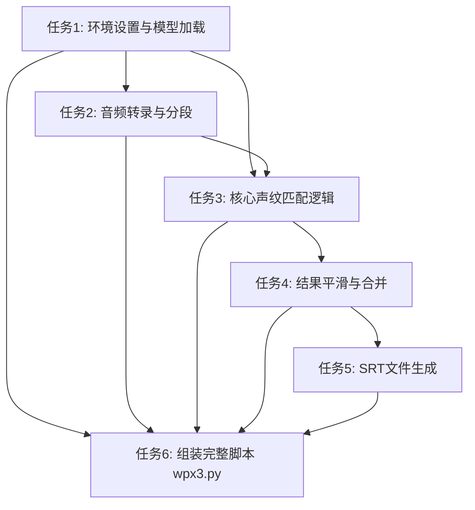

# 任务分解文档：高精度说话人识别流程 (wpx3)

## 1. 概述

本文件将 `DESIGN` 文档中描述的 `wpx3` 架构分解为一系列原子化的、可执行的开发子任务。每个任务都有明确的输入、输出、约束和依赖关系，以便于后续的自动化实现。

## 2. 任务依赖图

## 3. 原子任务列表

### **任务 1: `01_setup_and_init` - 环境设置与模型加载**
-   **输入契约**: `speaker_samples: dict` (说话人样本字典), `hf_token: str` (Hugging Face Token)。
-   **输出契约**: 返回一个包含已加载模型的字典 `models = {'embed_model': ..., 'asr_model': ...}` 和一个包含参考声纹的字典 `ref_embeddings = {'主持人': ..., '嘉宾': ...}`。
-   **实现约束**: 
    - 导入 `torch`, `pyannote.audio.Model`, `faster_whisper.WhisperModel`。
    - 自动检测CUDA设备。
    - 必须处理模型或样本文件加载失败的异常。
    - 生成的参考声纹必须经过归一化处理。
-   **前置依赖**: 无。

### **任务 2: `02_transcribe` - 音频转录与分段**
-   **输入契约**: `audio_path: str`, `asr_model` (来自任务1)。
-   **输出契约**: 返回一个分段列表 `segments`，其中每个元素是 `{'text': str, 'start': float, 'end': float}`。
-   **实现约束**: 
    - 调用 `asr_model.transcribe()` 并设置 `vad_filter=True`。
    - 需要将 `transcribe` 返回的生成器对象转换为列表。
-   **前置依赖**: 任务 1。

### **任务 3: `03_match_speakers` - 核心声纹匹配逻辑**
-   **输入契约**: `segments` 列表 (来自任务2), `full_audio_waveform: torch.Tensor`, `ref_embeddings` (来自任务1), `embed_model` (来自任务1)。
-   **输出契约**: 返回一个“已标注”的分段列表 `annotated_segments`。每个元素在原有基础上增加 `{'speaker': str, 'similarity': float}`。
-   **实现约束**: 
    - 循环遍历每个 `segment`。
    - 根据 `start` 和 `end` 从 `full_audio_waveform` 中提取音频切片。
    - 计算切片的声纹并与 `ref_embeddings` 中的所有参考声纹计算余弦相似度。
    - 将相似度最高的说话人赋给该 `segment`。
    - 如果最高相似度低于阈值（如0.5），则将说话人标记为 `UNKNOWN`。
-   **前置依赖**: 任务 1, 任务 2。

### **任务 4: `04_refine_results` - 结果平滑与合并**
-   **输入契约**: `annotated_segments` 列表 (来自任务3)。
-   **输出契约**: 返回一个最终的字幕条目列表 `final_subtitles`。每个条目包含合并后的文本、说话人、起始和结束时间。
-   **实现约束**: 
    - 实现一个简单的平滑逻辑，以纠正孤立的、错误的识别结果。
    - 遍历 `annotated_segments`，将连续的、属于同一说话人的 `segment` 合并成一个条目。
    - 合并文本内容，并为内容添加 `[说话人]: ` 前缀。
-   **前置依赖**: 任务 3。

### **任务 5: `05_generate_srt` - SRT文件生成**
-   **输入契约**: `final_subtitles` 列表 (来自任务4), `output_srt_path: str`。
-   **输出契约**: 在指定路径生成一个 `.srt` 文件。
-   **实现约束**: 
    - 使用 `srt` 库 (`import srt`) 来创建和写入文件，以确保格式的健壮性。
    - 时间戳需要从秒正确转换为 `timedelta` 对象。
-   **前置依赖**: 任务 4。

### **任务 6: `06_create_wpx3` - 组装完整脚本**
-   **输入契约**: 任务1至5中开发的所有函数。
-   **输出契约**: 一个功能完整、可独立执行的 `wpx3.py` 脚本文件。
-   **实现约束**: 
    - 将所有函数整合到一个文件中。
    - 创建一个 `main` 或 `if __name__ == '__main__':` 块，用于配置输入路径、调用主流程函数并打印最终结果。
    - 脚本需要有清晰的注释和参数配置区域。
-   **前置依赖**: 任务 1, 2, 3, 4, 5。
